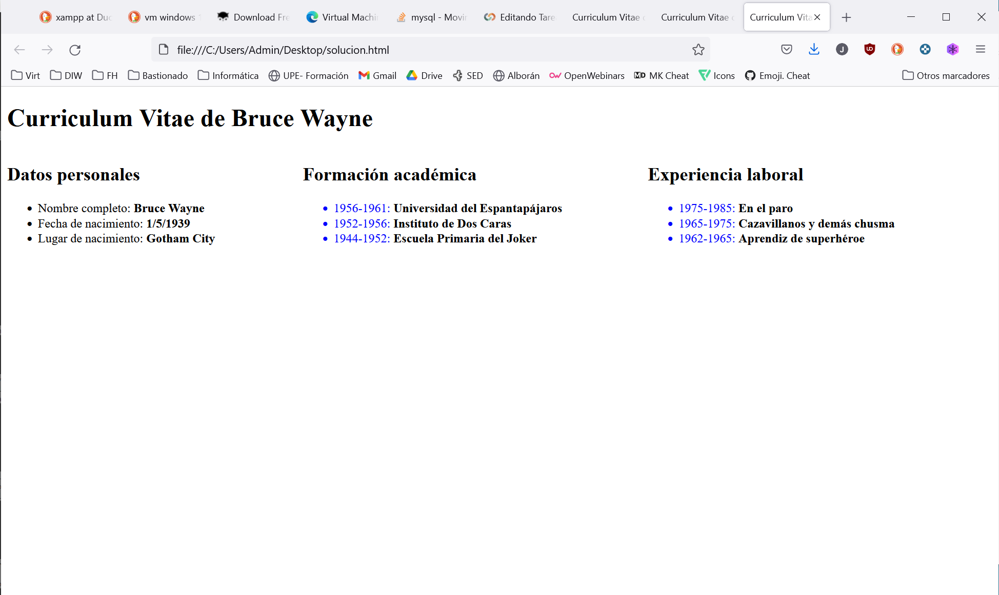
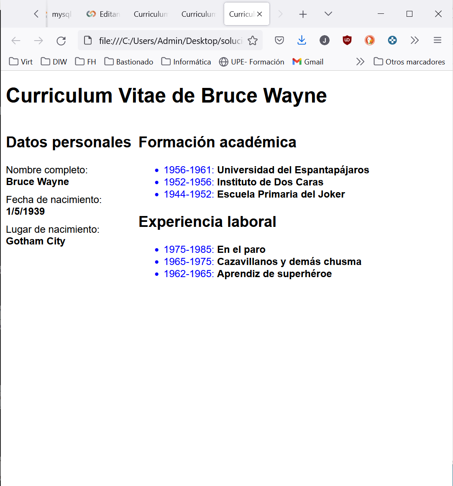
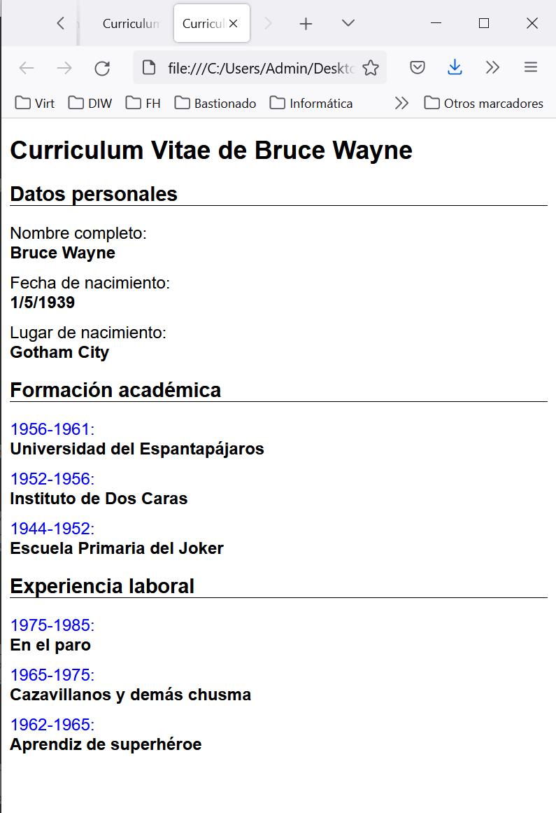

# Bruce Waine CV

A partir del siguiente sitio web, y utilizando una estrategia "Mobile First", adaptarlo para que se visualice de manera correcta en un dispositivo smartphone y en una tablet. Se pide:

- Maqueta el contenido y agrega una imagen
- Identificar la disposición de los elementos para cada una de las resoluciones.
- El diseño actual es una estructura de anchos fijos. El nuevo diseño se debe basar en una estructura de rejilla flexible.
- Aplicar propiedades CSS para los fondos, bordes redondeados, tipografías, animaciones...
- Aplica tamaño responsive al texto, para que en pantallas más pequeañas el texto disminuya.

## Imagenes de ejemplo

